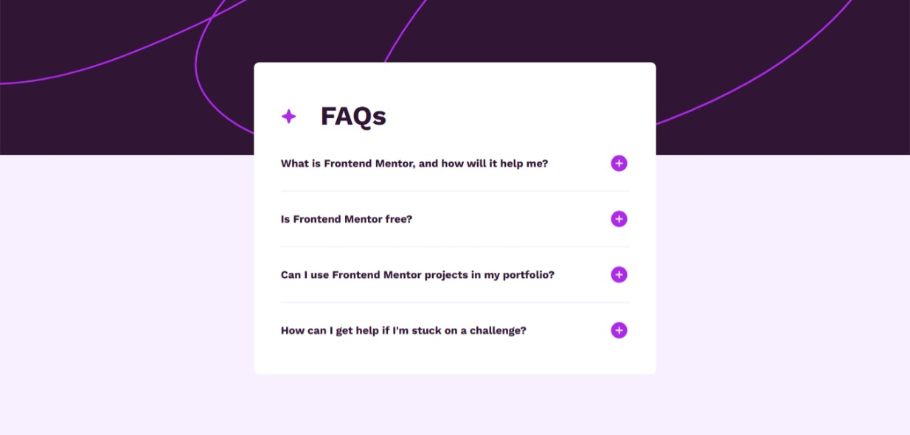

# Frontend Mentor - FAQ accordion solution

This is a solution to the [FAQ accordion challenge on Frontend Mentor](https://www.frontendmentor.io/challenges/faq-accordion-wyfFdeBwBz). Frontend Mentor challenges help you improve your coding skills by building realistic projects. 

## Table of contents

- [Overview](#overview)
  - [The challenge](#the-challenge)
  - [Screenshot](#screenshot)
  - [Links](#links)
- [My process](#my-process)
  - [Built with](#built-with)
  - [What I learned](#what-i-learned)
  - [Continued development](#continued-development)
- [Author](#author)


**Note: Delete this note and update the table of contents based on what sections you keep.**

## Overview

### The challenge

Users should be able to:

- Hide/Show the answer to a question when the question is clicked
- Navigate the questions and hide/show answers using keyboard navigation alone
- View the optimal layout for the interface depending on their device's screen size
- See hover and focus states for all interactive elements on the page

### Screenshot



### Links

- Solution URL: [https://github.com/EdgarPer/FaqAccordionMain.git]
- Live Site URL: [https://edgarper.github.io/FaqAccordionMain/]

## My process

### Built with

- Semantic HTML5 markup
- CSS custom properties
- Flexbox
- Mobile-first workflow
- JS Native

### What I learned

"I learned how to combine the flex and position properties to achieve the layout proposed in the challenge.


```html
<body>
<section class="header"></section>
<section class="main"></section>
</body>
```
```css
body{
  position:relative;
  display:flex;
  justify-content:center;
  align-items:center;
}
.header{
  position:absolute;
  top:0;
  left:0;
}
.main{
  min-height:377px;
}

```


If you want more help with writing markdown, we'd recommend checking out [The Markdown Guide](https://www.markdownguide.org/) to learn more.


## Author

- Website - [EdgarHuaman](https://www.your-site.com)
- Frontend Mentor - [@E.Roy](https://www.frontendmentor.io/profile/EdgarPer)


